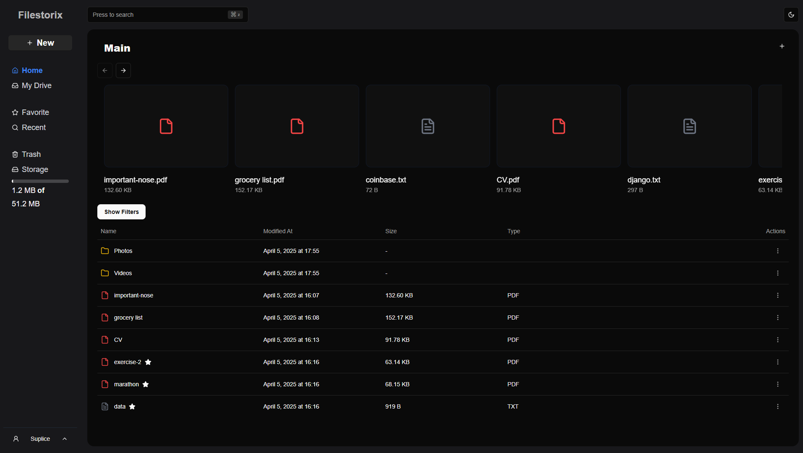
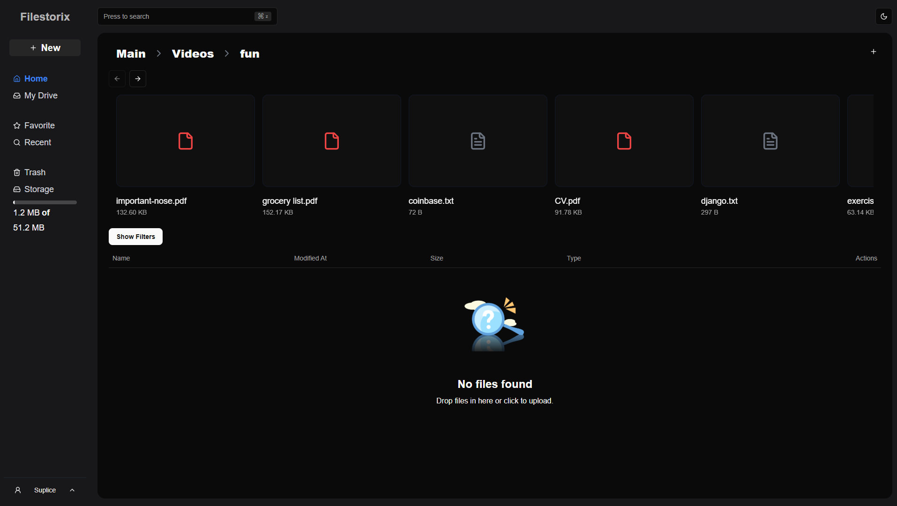
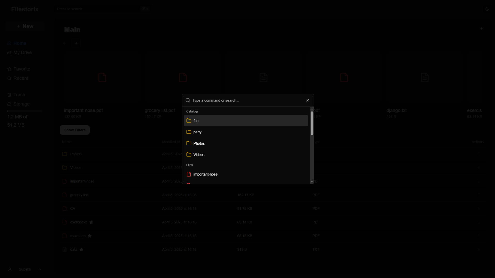
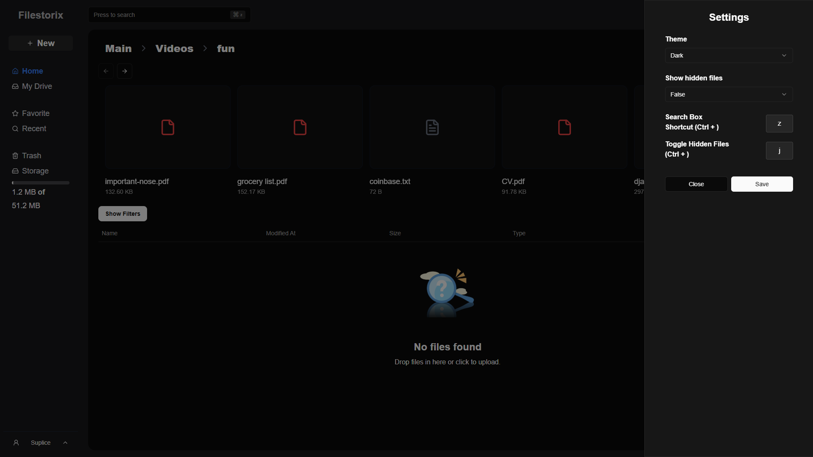
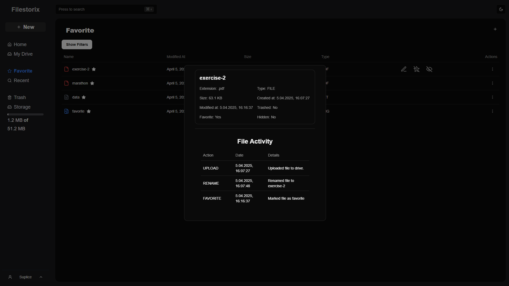
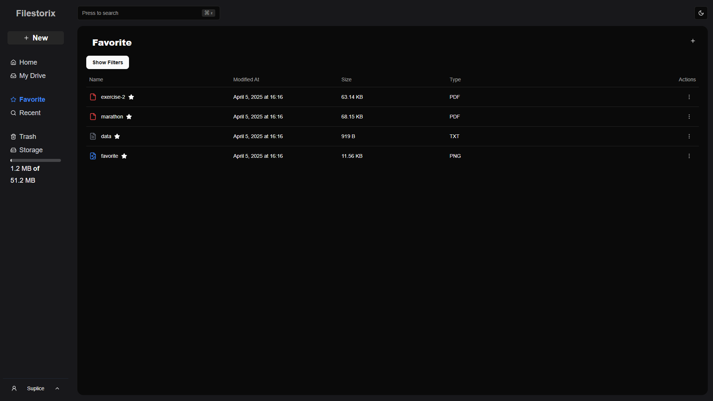
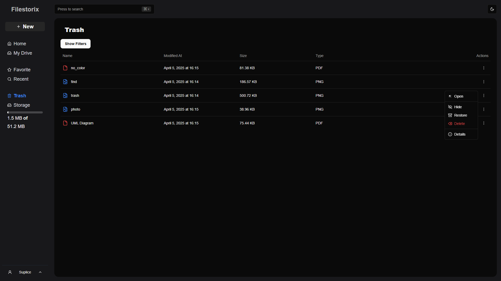

# Filestorix

Filestorix is a modern web application inspired by Google Drive, designed to securely store files, create directories, and manage content with ease. It offers a rich set of features including settings customization, intuitive organization, and seamless file sharing. With its sleek design and robust architecture, Filestorix provides a reliable and user-friendly solution for everyday cloud storage needs.

## Features 
 - Upload ans store files securely in custom directories
 - Preview images and PDFs directly within the app
 - Download files anytime with a single click
 - Create folders and organize your content eaisly
 - Move files to trash or hide them from view for better management

## Screenshots

### Main Page

### Catalog tree

### Search for files

### Settings

### File Details

### Favorite Files

### Trash

### Sign In Page

### Sign Up Page

## Technologies

### Frontend

 - Next.js
 - React JS
 - Typescript
 - Framer Motion + Tailwind CSS + Shadcn
 - React Redux
 - TanStack Query 

### Backend
 - Go
 - Gin

### Database
 - PostgreSQL

### Development Tools
 - Postman
 - VS Code
 - Prettier
 - React Dev Tools

## Contact
In case of any issues or for any other inquiries, please contact me at mateuszsuplice@gmail.com

